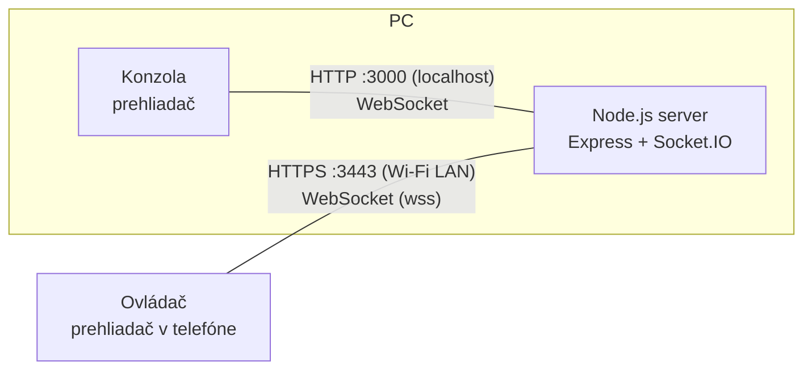
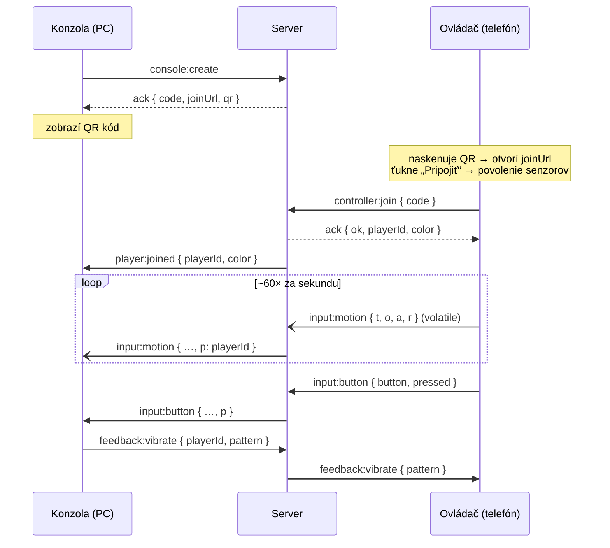

# WagglePlay – architektúra systému

## 1. Prehľad

Systém tvoria tri časti, ktoré všetky bežia **lokálne**. Nie je potrebný internet, externý server ani registrácia.

| Časť | Kde beží | Rola | Adresa |
|---|---|---|---|
| **Server** | Node.js na PC | Servíruje stránky, spravuje relácie, preposiela vstupy | – |
| **Konzola** | Prehliadač na PC | Zobrazí QR kód, vykresľuje hru, prijíma vstupy | `http://localhost:3000/console/` |
| **Ovládač** | Prehliadač v telefóne | Číta gyroskop/akcelerometer, posiela pohyb a tlačidlá | `https://<LAN-IP>:3443/controller/?s=KÓD` |



Server je iba **sprostredkovateľ (relay)** a správca relácií. Hernú logiku ani interpretáciu pohybu nerobí – to je úloha konzoly. Vďaka tomu je server jednoduchý a hry sa dajú pridávať čisto na strane prehliadača.

## 2. Kľúčové technické rozhodnutia

### 2.1 Prečo dva porty (HTTP + HTTPS)
Prehliadače sprístupnia `DeviceMotionEvent` a `DeviceOrientationEvent` iba v **zabezpečenom kontexte** (HTTPS).
`localhost` je zabezpečený kontext aj bez TLS, ale telefón pristupuje cez LAN IP adresu, takže potrebuje HTTPS.

- **HTTP :3000** počúva iba na `127.0.0.1` → konzola na PC, bez varovaní o certifikáte.
- **HTTPS :3443** počúva na `0.0.0.0` → ovládač z telefónu.

Obe počúvajú rovnakú Express aplikáciu a **jednu inštanciu Socket.IO**, takže miestnosti (rooms) sú zdieľané.

Certifikát je **self-signed**, generuje sa automaticky pri prvom spustení (`server/certs.js`) a ukladá do `.certs/`.
Obsahuje LAN IP v `subjectAltName`; pri zmene IP (iná Wi-Fi) sa pregeneruje.
Nevýhoda: telefón pri prvom otvorení zobrazí varovanie, ktoré treba raz potvrdiť („Pokračovať aj tak“).

### 2.2 Prečo WebSocket (Socket.IO)
- Obojsmerné, stále otvorené spojenie → nízka latencia bez réžie HTTP požiadaviek.
- Socket.IO pridáva miestnosti, automatické znovupripojenie a potvrdenia (ack) – veci, ktoré by sme nad čistým `ws` písali ručne.
- Klienti používajú iba `transports: ['websocket']` (bez long-pollingu) kvôli latencii.
- Pohybové dáta sa posielajú ako **volatile** – ak sa sieť zahltí, staré pakety sa zahodia namiesto hromadenia. Pri pohybe nás zaujíma iba najnovší stav.

### 2.3 Relácia a párovanie cez QR kód
- Každá otvorená karta konzoly = jedna **relácia** so 4-znakovým kódom (bez zameniteľných znakov 0/O, 1/I).
- QR kód obsahuje URL `https://<LAN-IP>:3443/controller/?s=<KÓD>` a generuje sa na serveri (knižnica `qrcode`).
- Relácia má max. **4 hráčov**; každý dostane číslo slotu a farbu.
- Relácie existujú iba v pamäti servera – nič sa neukladá.

## 3. Priebeh komunikácie



### 3.1 Udalosti (zdroj pravdy: `shared/protocol.js`)

| Udalosť | Smer | Dáta | Spoľahlivosť |
|---|---|---|---|
| `console:create` | K → S | – (ack: `{code, joinUrl, qr}`) | spoľahlivá |
| `controller:join` | T → S | `{code, playerId?}` (ack: `{ok, playerId, color}` / `{ok:false, error}`) | spoľahlivá |
| `input:motion` | T → S → K | `{t, o:[α,β,γ], a:[x,y,z], r:[α,β,γ], m, c?:[x,y,roll], s?}` + server pridá `p` | **volatile** |
| `input:button` | T → S → K | `{button: A/B/HOME, pressed}` + `p` | spoľahlivá |
| `feedback:vibrate` | K → S → T | `{playerId, pattern}` | spoľahlivá |
| `player:joined` / `player:left` | S → K | `{playerId, color?}` | spoľahlivá |
| `session:closed` | S → T | – | spoľahlivá |

`protocol.js` je čistý ES modul bez závislostí – importuje ho server aj oba prehliadačové klienty (`/shared/protocol.js`), takže názvy udalostí nemôžu medzi časťami „rozísť“.

### 3.2 Pohybový paket
- `o` – orientácia z `deviceorientation` (stupne): α = otočenie okolo zvislej osi, β = predklon/záklon, γ = náklon do strán.
- `a` – zrýchlenie vrátane gravitácie z `devicemotion` (m/s²) – vhodné na detekciu švihu/úderu.
- `r` – uhlová rýchlosť z gyroskopu (°/s).
- `t` – časová značka odosielateľa (na meranie latencie/jitteru).
- `m` – režim ovládača (`pointer` / `wheel`), viď 3.3.
- `c` – iba v režime `pointer`: kurzor `[x, y, roll]`, x a y od -1 do 1 (stred = 0, 0), roll v stupňoch.
- `s` – iba v režime `wheel`: natočenie volantu od -1 (doľava) po 1 (doprava).

Telefón **nevysiela pri každej udalosti senzora** (tie chodia nepravidelne, niekedy 100+ Hz), ale ukladá si posledné hodnoty a vzorkuje ich pevnou frekvenciou `MOTION_HZ = 60`. To dáva predvídateľnú záťaž siete.

### 3.3 Režimy ovládača (`public/controller/modes.js`)
Telefón podľa toho, ako ho hráč drží, sám prepína medzi dvomi režimami a do paketu posiela už hotové hodnoty, takže hry nemusia počítať s uhlami.

| Režim | Držanie | Výstup |
|---|---|---|
| **pointer** (Wii Remote) | na výšku, vrch mieri na obrazovku | kurzor `c = [x, y, roll]` |
| **wheel** (Wii Wheel) | na šírku, displej k hráčovi | volant `s` |

- **Rozpoznanie režimu:** zo smeru gravitácie (vypočítaného z `deviceorientation` β, γ – tie majú na iOS aj Androide rovnaké znamienka, akcelerometer nie). Keď je telefón otočený na bok viac ako ≈53°, prepne sa na volant; späť na kurzor pod ≈30° (hysterézia). Nová poloha musí vydržať 300 ms.
- **Kurzor (laser):** poloha kurzora = smer, ktorým mieri vrch telefónu (vektor osi y z celej orientácie α, β, γ – nie priamo z uhlov, tie pri mierení „cez hlavu“ preskakujú). Rovnaký smer v miestnosti = vždy rovnaký bod na obrazovke, čo je nutné pre kreslenie. Zvislá os sa neposúva (drží ju gravitácia); vodorovná sa môže za dlhší čas mierne posunúť (bez kompasu nemá telefón pevný bod) – vtedy pomôže **⌖ Stred**.
- **Mierka:** stupne na jednotku sú v oboch osiach rovnaké vzhľadom na pomer strán 16:9, takže nakreslený kruh ostane kruhom.
- **Vyhladzovanie:** One Euro filter – pri pomalom pohybe silné (bez chvenia pri kreslení), pri rýchlom takmer žiadne (švih vo Fruit Ninja bez oneskorenia).
- **Kalibrácia:** aktuálny smer sa stane stredom obrazovky pri každom prepnutí do režimu pointer a tlačidlom **⌖ Stred** na telefóne. Kurzor je obmedzený kúsok za okraj obrazovky; po návrate telefónu je späť presne tam, kam mieri.
- **Volant:** uhol smeru gravitácie v rovine displeja, s mŕtvou zónou 3° a vyhladzovaním; ±60° = naplno.
- Citlivosť a prahy sú konštanty na začiatku `modes.js`.

### 3.4 Konzola a hry
- **Domovská obrazovka** (`public/console/`): mriežka hier zo zoznamu `public/games/games.js`, QR panel a sloty hráčov. Každý telefón v režime pointer má na obrazovke kurzor; nabehnutie na hru = krátka vibrácia, **A** = spustenie. Funguje aj myš (klik) a Esc.
- **Hra** je ES modul `public/games/<id>/game.js` s `export default function start(api)`. Konzola ho načíta dynamickým `import()` až pri spustení a vykreslí ho do plochy cez celé okno.
- Hra dostáva vstupy cez `api.on('motion' | 'button' | 'join' | 'leave', …)` a stav hráčov v `api.players` (kurzor, volant, tlačidlá). Popis API: `public/games/README.md`.
- Tlačidlo **⌂ Domov** na telefóne (alebo Esc) hru ukončí – konzola odhlási jej odbery, zavolá upratovaciu funkciu hry a vymaže plochu. Hra sa o tlačidle HOME nedozvie.

### 3.5 Výpadky spojenia
- **Telefón stratí spojenie:** konzola dostane `player:left`, slot ostane rezervovaný 15 s. Socket.IO sa sám znovu pripojí a telefón pošle `controller:join` s pôvodným `playerId` (uloženým v `sessionStorage`) → dostane rovnaký slot aj farbu.
- **Konzola sa zatvorí:** relácia zanikne, telefóny dostanú `session:closed`.

## 4. Štruktúra projektu

```
WagglePlay/
├── bin/waggleplay.js        # CLI vstup (npx / globálna inštalácia)
├── server/
│   ├── index.js             # štart: Express, HTTP+HTTPS, Socket.IO, výpis adries, otvorenie prehliadača
│   ├── config.js            # porty a nastavenia (prepísateľné cez env premenné)
│   ├── network.js           # zistenie LAN IP adresy
│   ├── certs.js             # generovanie/cache self-signed certifikátu
│   ├── sessions.js          # správa relácií a hráčskych slotov
│   ├── socket.js            # Socket.IO udalosti – routing medzi konzolou a ovládačmi
│   └── open-browser.js      # otvorenie konzoly v predvolenom prehliadači
├── shared/
│   └── protocol.js          # názvy udalostí a konštanty (server + prehliadače)
├── public/
│   ├── console/             # UI konzoly (PC): domovská obrazovka, kurzory, spúšťanie hier
│   ├── controller/          # UI ovládača (telefón); modes.js = režimy kurzor/volant
│   └── games/
│       ├── games.js         # zoznam hier na domovskej obrazovke
│       ├── README.md        # API pre hry
│       └── <id>/game.js     # jednotlivé hry (test/ = test ovládačov)
└── docs/ARCHITECTURE.md
```

## 5. Bezpečnosť a obmedzenia
- HTTP port konzoly je dostupný iba z `localhost`; do LAN je vystavený iba HTTPS port.
- Kto pozná kód relácie a je v rovnakej sieti, môže sa pripojiť ako hráč – pre domáce použitie akceptovateľné.
- Siete s „client isolation“ (niektoré verejné/firemné Wi-Fi) blokujú komunikáciu zariadení medzi sebou – vtedy sa telefón nepripojí. Riešením je domáca sieť alebo hotspot z telefónu.
- Firewall na PC musí povoliť prichádzajúce spojenia na port 3443.

## 6. Ďalšie kroky
1. Pomôcky pre hry: rýchlosť kurzora (detekcia švihu), „ťah“ pri držaní A (kreslenie).
2. Prvá hra (napr. bowling alebo tenis využívajúci švih).
3. Meranie latencie (ping/pong s `t`) a zobrazenie v konzole.
